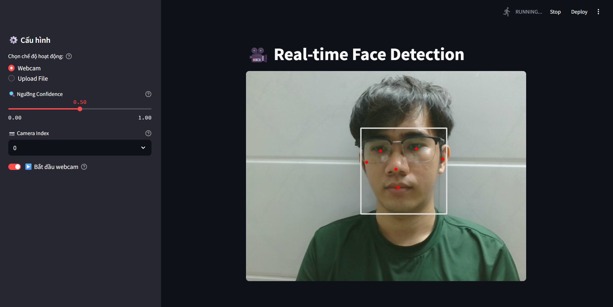
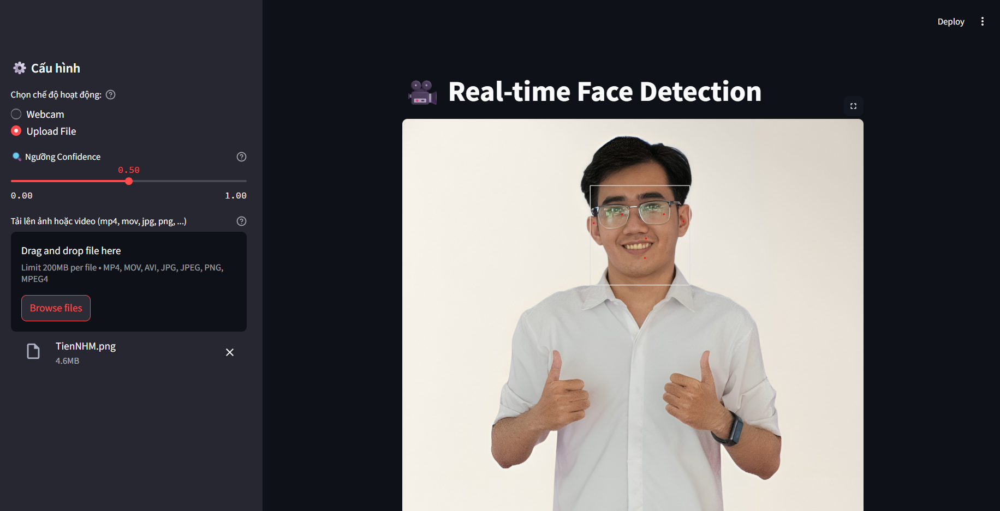

# Face Detection Real-Time with MediaPipe and Streamlit

This project demonstrates how to create a real-time face detection application using MediaPipe and Streamlit. The application captures video from the webcam, detects faces, and displays the results in real-time.

## Live Demo
You can try the live demo of the application at: https://tiennhm-face-detection-realtime.streamlit.app/

## Features
- Real-time face detection using webcam input.
- Upload an image for face detection.
- Upload a video file for face detection.
- Display detected faces with bounding boxes.
- User-friendly interface with Streamlit.

## Requirements
- Python 3.7 or higher
- Streamlit
- MediaPipe
- OpenCV

## Installation
1. Clone the repository:
   ```bash
   git clone https://github.com/TienNHM/face-detection-realtime.git
   ```

2. Create a virtual environment (optional but recommended):
    - On Windows:
    ```bash
    python -m venv venv
    venv\Scripts\activate
    ```

    - On macOS/Linux:
    ```bash
    python3 -m venv venv
    source venv/bin/activate
    ```

3. Install the required packages:
   ```bash
   pip install -r requirements.txt
   ```

## Running the Application
To run the application, execute the following command in your terminal:

```bash
streamlit run app.py
```
This will start a local server and open the application in your default web browser. Visit [`http://localhost:8501`](http://localhost:8501) to view the application.





## Docker Support
To run the application using Docker, follow these steps:
1. Build the Docker image:
   ```bash
   docker build -t face-detection-app .
   ```

2. Run the Docker container:
   ```bash
   docker run -p 8501:8501 face-detection-app

   docker run -it --rm --device=/dev/video0 --privileged -p 8501:8501 face-detection-app

   ```

This will start the application in a Docker container, and you can access it at [`http://localhost:8501`](http://localhost:8501).

⚠️ IMPORTANT: When running the Docker container, ensure that you have the necessary permissions to access the webcam device. You may need to run the command with `sudo` on Linux systems. If you are running on Windows using Docker Desktop, you CANNOT access the webcam directly. Instead, you can use the image/video upload feature only.

## Contributing
If you would like to contribute to this project, feel free to submit a pull request or open an issue for any bugs or feature requests.
